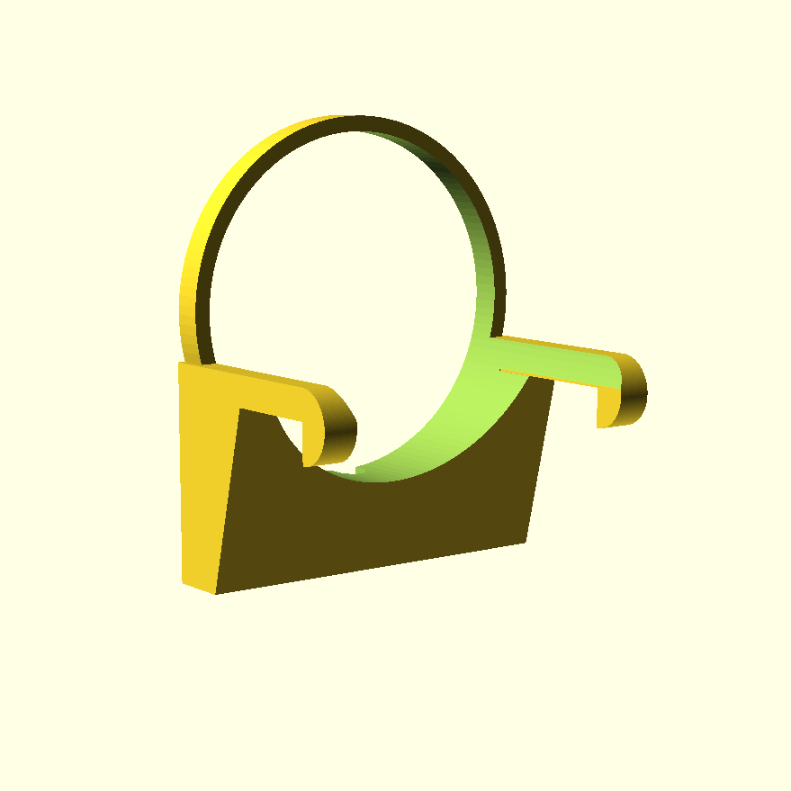

# magsafe-mount-openscad

An OpenSCAD MageSafe mount for phones to hang off monitors.
This not affliated with Apple in any shape or form.
This is just someone who wants to put their 
Place a [MageSafe Charger](https://www.apple.com/shop/product/MHXH3AM/A/magsafe-charger) into the ring in the middle and then place it on monitor.

It's really just an open source parametric version of [something like this](https://www.etsy.com/market/continuity_camera_mount).
The STL uploaded is for my monitor (the HP X34 which is a decent monitor for the price).

Alternatively, if you don't want to print one, you can [buy one from Belkin from the Apple Store](https://www.apple.com/shop/product/HQ642ZM/A/belkin-iphone-mount-with-magsafe-for-mac-notebooks) or one of the thousands on Etsy.

It is very much inspired by the one [Gooshy made](https://github.com/Gooshy/continuity-camera-mount) and is licensed under a CC license.

## Why do I want this?

Here's [a verge article](https://www.theverge.com/2022/6/7/23158510).

## OpenSCAD?

Yes, this a parametic model and can easily be adapted to any monitor.
If you're curious about OpenSCAD, [the documentation is quite good](https://openscad.org/documentation.html).
Even if you've never used OpenSCAD before, you should be able to figure it out even to tweak it for your monitor.
If you don't want to install it on your desktop, there is a [web version that runs by the power of wasm](https://openscad.cloud/openscad/).

## License

This work is licensed under a [Creative Commons Attribution NonCommercial ShareAlike International License](https://creativecommons.org/licenses/by-nc-sa/4.0/legalcode).

In a nutshell, feel free to print it for your own use but don't sell it.
If you make a remix or derivative work, it must be under this same license.

Be cool.

## Trademark

MageSafe is a registered trademark of Apple Inc.
I cannot stress enough that this is not endorsed, sponsored by, or associated with Apple or Apple products.